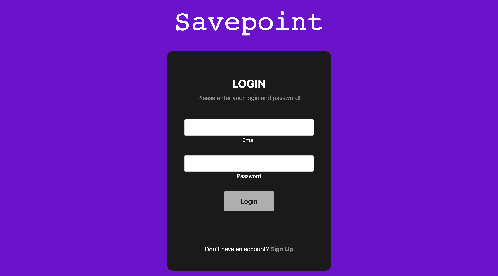
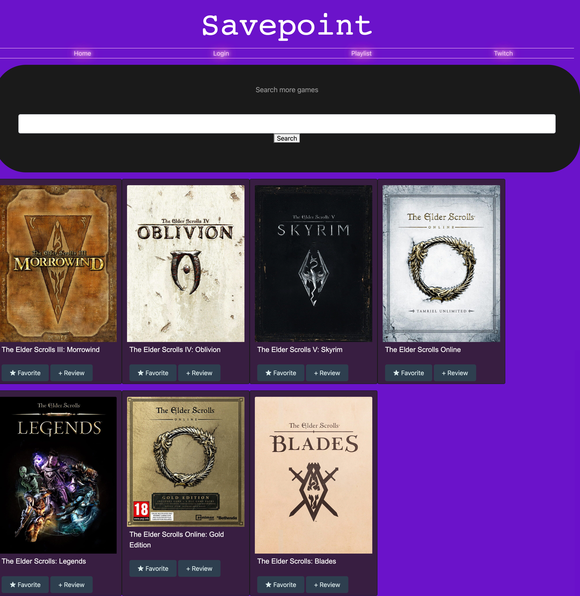

# Savepoint

*With this website, users can login to review their favorite saved games or add games to a wishlist to help keep track of games they would like to try out. Users can also search for new possible games to play with a searchbar that will pull up data based on genre or game console preference.*

Deployed version can be found [Here](https://mysterious-atoll-10250.herokuapp.com/landing/login)

 ## How to use this site:
1. The landing page will be a login screen- users can not see this website until they have logged in first. If they have not logged in, they will be redirected back to the landing page to encourage a login process.
2. Once logged in, users can see a navigational header that never changes in order to have routes available on every page. The user will also see the homepage after login, which will allow them to see game recommendations as well as a search bar.
3. If a user searches for a game, they will see a results page which allows them to see a picture of the game, the title, and the description of the game as well as reviews from other users. Then, they can add the game to their wishlist or played list- which can be viewed in another route.
4. If the users chooses, they can view their lists- a played already list and a wishlist of games they would like to try.

## PowerPoint Presentation

[SavePoint Presentation](https://docs.google.com/presentation/d/17pfS_hZK4mhiiGfGLVumj8adZYPEiH0F1HKXs5503CM/edit#slide=id.g129d478b827_0_135)

## Please see the video down below for the demo:

Click [Here](https://drive.google.com/file/d/1pus2LdmIbdQtQfkrcDgo7-C4wQN4tJD-/view) to view google drive video

## Some pictures of the final product!

## Indepth analysis

With this website, users are able to login with their unique credentials in order to have full access to our database. The inspiration behind the website is the IGDB website and API. In the IGDB website, users are able to search for new games and leave reviews for games they have played; plus so much more. We wanted to create a similar reference for gamers where they can search new games, add games to their wishlist, and view their list of played games. With an arcade themed website, we wanted to model a community for gamers to immurse themselves in the world of gaming. This project requires a ton of backend work; from SQL to DBeaver, all the way to Handlebars to create dynamic webpages. Our API was created to GET, POST, PUT, and DELETE new items while functioning with the frontend of the website to make it more user friendly. 

With many npm packages installed, we were able to execute this project as a team quite seamlessly. In order to finish this, we had to refactor other codes and add our own paths in order to get the response we were looking for. The biggest challenge in this project was debugging because the routes would work but they were set to different locations in the file. After overcoming that, the project came together much nicer. If we had more time, we would focus more on styling to make the UI design more appealing, however the main focus was getting results on the page. Overall, this project would not come to life without the collaboration.

## Technology Used

- HTML
- CSS
- JavaScript
- SQL
- Bootstrap
- Express.js
- Sequelize
- IGDB.com API
- Just in Mind wireframe
- Heroku
- Handlebars
- Node.js
- DBeaver

## User's Personal Github Accounts

[Hailey Bates-Corona](https://github.com/haileyrb25)

[Lex Matthews](https://github.com/ArchRascal2988)

[Michael Sands](https://github.com/Msands21)

[Ricky Thakar](https://github.com/Rickythakar)

[Rajiv Tiwari](https://github.com/Drago9082)

## Special Thanks to the instructional team at UCF Coding Bootcamp

[John Dinsmore](https://github.com/djibba22)

[Veronica Harris](https://github.com/VHarris113)

[Andy Waine](https://github.com/Andy-Waine)

